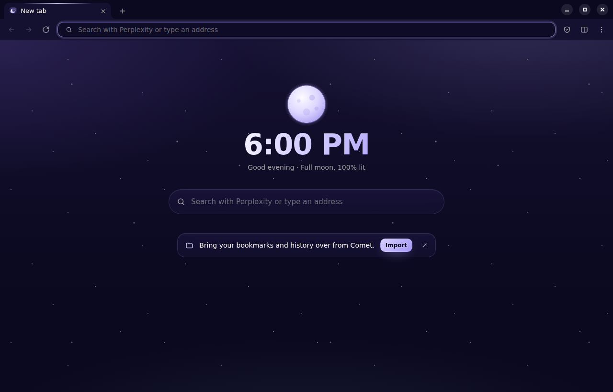
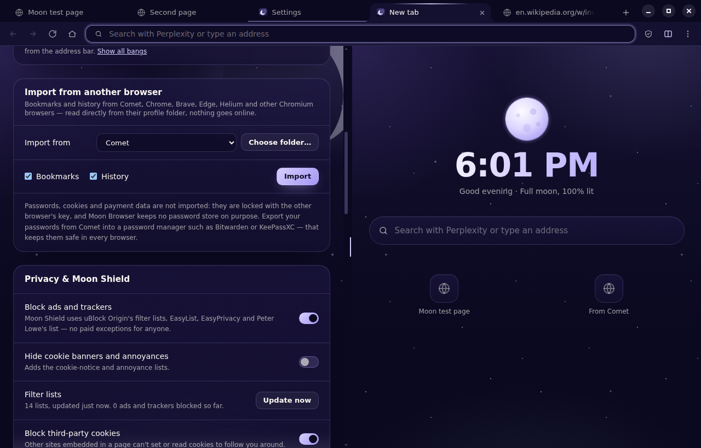
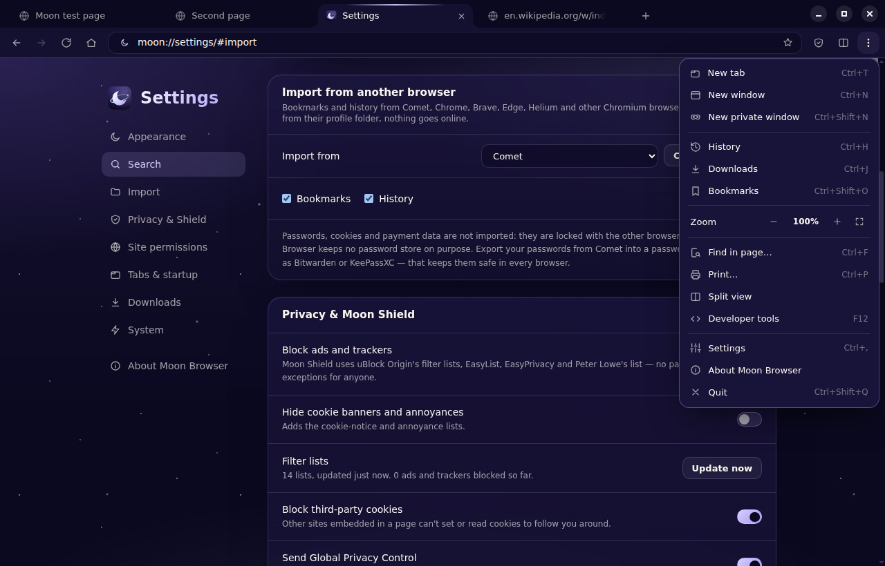
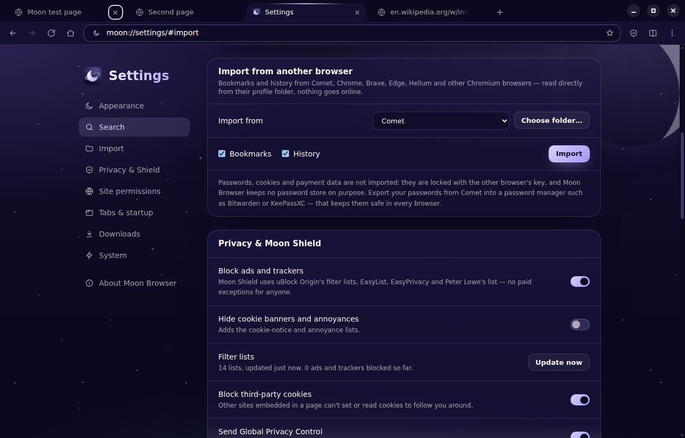

# Moon Browser

> The web, calmly under the moon.

Moon Browser is a private, open-source Chromium browser for Windows and Linux — in the spirit of
[Helium](https://github.com/imputnet/helium): no bloat, no noise, ad and tracker blocking built in,
and nothing phoning home. It wears the same night-sky design as
[MoonDisk](https://github.com/Luna-OS/MoonDisk) and [MoonTask](https://github.com/Luna-OS/Moon-Task).







## Features

- **Perplexity search** by default — answers instead of a list of links. DuckDuckGo, Startpage,
  Brave Search, Kagi, Ecosia, Qwant, Google, Bing or your own engine are one click away.
- **Bangs** straight from the address bar, like Helium's native bangs: `!w moon` searches
  Wikipedia, `!yt` YouTube, `!gh` GitHub, `!p` Perplexity — 60 of them, resolved locally.
- **Moon Shield** — ads and trackers blocked with uBlock Origin's filter lists, EasyList,
  EasyPrivacy and Peter Lowe's list (no "acceptable ads" exceptions), including cosmetic filters
  and scriptlets. Optional cookie-banner and annoyance lists. One click switches it off per site.
- **Import from Comet** — bookmarks (with their folders, just as they were) and history from
  Comet, Chrome, Brave, Edge, Helium, Vivaldi or any other Chromium browser, read directly from
  its profile folder — Chrome's bookmarks saved in your Google Account included
- **Chrome extensions** from the Chrome Web Store — your password manager (NordPass, Bitwarden,
  1Password, …) with its toolbar button and pop-up, and side-panel extensions like Claude. The
  puzzle button lists them like Chrome does (*Full access* / *No access needed* on the current
  site), pins them to the toolbar and opens their options. Before an extension is added, Moon
  Browser shows what it will be able to do; `moon://extensions` switches them off, removes them
  and shows their errors, and repairs an extension whose files got damaged.
- **Developer mode** on `moon://extensions` — load your own extension from a folder (*Load
  unpacked*), reload it after changes, see its ID and errors
- **Updates without reinstalling** — Moon Browser downloads a new version in the background; one
  click on *Update* installs it over the old one and brings your tabs back
- **Default browser in one click** — from the new tab page, the menu or *Settings → System*
- **Signing in to Google works** — Google turns away browsers that look like an app with a
  browser built in ("This browser or app may not be secure"). Moon Browser gives pages Chrome's
  whole `window.chrome` and says the same Chromium everywhere: in its user agent, its client
  hints and to scripts. "Sign in with Google" on other sites opens Google's pop-up
- **Tab groups** like Chrome's — right-click a tab → *Add tab to new group*, give the group a
  name and a colour, click its label to collapse it, drag tabs in and out, drag the label to move
  the whole group. Extensions can use them through `chrome.tabGroups`.
- **Continue where you left off** — your tabs and tab groups come back after a restart (switch
  it off under *Settings → Tabs & startup*)
- **Split view** — two tabs side by side, with a divider to resize
- **Sleeping tabs** — tabs you haven't looked at for a while give their memory back and wake up
  when you return
- **Address bar** with suggestions from your history, bookmarks and open tabs, and inline
  completion — suggestions never leave your computer
- **Private windows** with their own in-memory session, wiped when the last one closes
- Tabs you can pin, mute, duplicate, drag around and reopen after closing
- A quiet taskbar icon: sites can't put their unread counts on it (`navigator.setAppBadge` does
  nothing, as in Chrome for sites that aren't installed apps)
- **Bookmarks with folders** — on the bookmarks bar a folder opens as a menu (folders inside
  it too); the star (`Ctrl D`) names a bookmark and puts it in a folder, or in a new one;
  `moon://bookmarks` sorts them, and a right-click on the bar opens a folder's bookmarks all at
  once, renames it or moves things to another folder. Folders hold folders: *New folder in …*
  in a folder's menu, its right-click menu, the star's editor (`+`) and on `moon://bookmarks`. Show the bar or not — your choice: in the menu, on
  `moon://bookmarks`, in the star's editor, with a right-click on the bar or with `Ctrl Shift B`
- History, downloads, find in page, zoom per site, print, full screen, developer tools
- **Night and day themes** (or follow the system); websites follow along when they support dark
  mode
- A new tab page with the **real moon phase** of today



## Privacy and security

Moon Browser is built to be safe by default. See [SECURITY.md](SECURITY.md) for the details.

- **No telemetry, no accounts, no sync.** Moon Browser only goes online for the pages you open,
  to refresh its filter lists every few days and to look for a new release on GitHub (every few
  hours; *Settings → Updates* switches it off). Installed extensions are kept up to date from the
  Chrome Web Store. Even Chromium's spell-check dictionaries are not fetched from Google unless
  you switch spell checking on (Linux).
- **HTTPS first** — every site is tried over HTTPS; if a site has no working HTTPS, or sends you
  back to HTTP, Moon Browser warns before loading it insecurely. Nothing is downgraded silently.
- **Dangerous pages are stopped** before they load: sites on the malware, scam and tracker lists
  get a warning page instead (like uBlock Origin's strict blocking).
- **Third-party cookies blocked**, **Global Privacy Control** sent, **tracking parameters**
  (`utm_…`, `fbclid`, `gclid`, …) removed from links, **WebRTC** can't reveal your local IP,
  **secure DNS** (DNS over HTTPS, with Quad9, Mullvad or Cloudflare to choose) — or **your own
  DNS server**, named as you like: a Pi-hole or Unbound at home or one in Netbird or Tailscale
  by IP address and port (`100.64.0.53:5335`), or any DNS-over-HTTPS address
  (*Settings → Privacy & Shield → Your DNS servers*).
- **Permissions are asked for** — camera, microphone, location, notifications, clipboard,
  opening other apps and pop-ups without a click. Until you've answered, sites see "not asked
  yet" (as in Chrome), not "blocked", so they ask. USB, serial, HID and Bluetooth access are
  refused.
- **Downloads** — programs and scripts are held under a harmless name (`Unconfirmed ….crdownload`)
  until you choose *Keep anyway*, and on Windows every download gets the Mark of the Web, so
  SmartScreen checks it.
- **Questions in Moon Browser's own dialogs** — adding or removing an extension, its requests
  for more access, program downloads, *Leave site?* and a page's `alert()`, `confirm()` and
  `prompt()` are asked in the night-sky look over the window, not in the system's message box.
  A page that keeps asking can be stopped (*Don't let this page show more dialogs*).
- **Sandboxed everything** — every page, Moon Browser's own pages and the browser UI run in
  Chromium's sandbox with context isolation; web pages can't reach the internal API or the
  `moon://` pages, and every IPC message is checked for who sent it.
- **Security updates on their own** — Chromium's security fixes (the ones Chrome and Helium
  ship) reach Moon Browser through Electron's patch releases. Every six hours a workflow looks
  for one, runs every test with it and, if they all pass, releases the next version; your copy
  then updates itself.
- **Hardened app** — Electron fuses are flipped in the shipped binary: no running as Node.js,
  no `--inspect`, no `NODE_OPTIONS`, only the integrity-checked `app.asar` is loaded, and
  **cookies are encrypted on disk** with the system's key store.
- **No built-in password store** — on purpose. Add your password manager's extension (NordPass,
  Bitwarden, 1Password, …) from the Chrome Web Store instead.
- **Extensions only with your OK** — each one shows its permissions before it is added, only
  comes from the Chrome Web Store, and never runs in private windows.
- Optional: delete cookies and site data every time Moon Browser closes.

## Keyboard

| Keys                              | Action                                |
|-----------------------------------|---------------------------------------|
| `Ctrl T` / `Ctrl W`               | New tab / close tab                   |
| `Ctrl Shift T`                    | Reopen the last closed tab            |
| `Ctrl Tab` / `Ctrl Shift Tab`     | Next / previous tab                   |
| `Ctrl 1` … `Ctrl 8`, `Ctrl 9`     | Go to tab 1 … 8, to the last tab      |
| `Ctrl L`, `Alt D`, `F6`           | Address bar                           |
| `Alt Enter` in the address bar    | Open in a new tab                     |
| `Ctrl N` / `Ctrl Shift N`         | New window / new private window       |
| `Alt ←` / `Alt →`                 | Back / forward                        |
| `Ctrl R`, `F5` / `Ctrl Shift R`   | Reload / reload without cache         |
| `Ctrl F`, `F3` / `Shift F3`       | Find in page / next / previous match  |
| `Ctrl D`                          | Bookmark this page (name, folder)     |
| `Ctrl H` / `Ctrl J` / `Ctrl Shift O` | History / downloads / bookmarks    |
| `Ctrl Shift B`                    | Show or hide the bookmarks bar        |
| `Ctrl +` / `Ctrl -` / `Ctrl 0`    | Zoom in / out / reset                 |
| `Ctrl ,`                          | Settings                              |
| `Ctrl Shift Delete`               | Clear browsing data                   |
| `F11` / `F12`                     | Full screen / developer tools         |
| `Ctrl Shift Q`                    | Quit                                  |

## Installation

Installers for **Windows** (`.exe`, x64; runs on ARM64 through Windows' emulation) and **Linux**
(`.AppImage`, `.deb`, `.rpm`) are published on the
[Releases](https://github.com/Luna-OS/Moon-Browser/releases) page. macOS follows later.

- **Windows:** run the installer — it installs for your user account, needs no administrator
  rights and lets you choose the folder. Moon Browser registers itself as a web browser; *Make
  default* (new tab page, menu or settings) opens Windows' *Default apps* with Moon Browser
  preselected.
- **Linux:** install the `.deb` or `.rpm`, or make the `.AppImage` executable and start it.
  On Ubuntu 24.04 and newer, prefer the `.deb`: it sets up Chromium's sandbox helper, which the
  AppImage can't.

The builds are not code-signed yet, so Windows SmartScreen asks once before the first start
(*More info → Run anyway*).

### Updates

Moon Browser looks for a new release every few hours and downloads it in the background. When
it is ready, an **Update** button appears next to the menu: click it and Moon Browser restarts
into the new version with your tabs. Nothing has to be uninstalled, and your profile —
bookmarks, history, settings, extensions — stays where it is. *Settings → Updates* shows the
state and has a *Check now* button.

- **Windows:** the new installer runs silently over the installed version (also when you quit).
- **AppImage:** the AppImage file is replaced.
- **.deb / .rpm:** the package is installed with your system's package tool, which asks for your
  password — so only when you click *Update*.

Running the installer of a newer version by hand works too: it updates in place.

### Using NordPass (or another password manager)

1. Open *Menu → Extensions* and click **Chrome Web Store** (or go straight to
   [NordPass in the Chrome Web Store](https://chromewebstore.google.com/detail/eiaeiblijfjekdanodkjadfinkhbfgcd)).
2. Click **Add to Moon Browser** and confirm what the extension may do.
3. The NordPass button appears in the toolbar: sign in there. Autofill, saved logins and the
   2FA codes of NordPass Authenticator all live in the extension.
4. On Windows, NordPass can use **Windows Hello** (fingerprint, face or PIN) to unlock and for
   NordPass Authenticator: Moon Browser passes the extension's request to Windows' own
   WebAuthn dialog, laid out exactly as Chrome lays it out. Should Windows refuse it at once,
   Moon Browser tries again from the page's own window and with the older layout, and
   `moon://extensions` lists what Windows said to each try.

Extensions get the Chrome APIs password managers rely on — storage, alarms, idle, tabs, windows,
scripting, cookies, context menus, notifications, offscreen documents, identity (sign-in
windows), pop-ups and content scripts. Talking to the NordPass *desktop app* (native messaging)
uses the connection the app registers for Google Chrome. If an extension misbehaves,
`moon://extensions` shows its errors under *Errors*. Messages an extension sends while none of
its pages is open to receive them (*Could not establish connection. Receiving end does not
exist.*) are harmless and not listed — only for your own extensions, loaded from a folder in
developer mode, where they can help.

### Coming from Comet

Open *Settings → Import* (the new tab page offers it on a fresh profile too), pick Comet and
import your bookmarks and history. The bookmarks keep their folders, and the bookmarks bar
switches on to show them. If Comet isn't found automatically, *Choose folder…* and
point Moon Browser at Comet's profile folder (on Windows usually
`%LOCALAPPDATA%\Perplexity\Comet\User Data\Default`). Passwords stay out on purpose: export them
from Comet into a password manager.

## How it compares to Helium

Helium is a patched Chromium (on top of ungoogled-chromium). Moon Browser takes Helium's ideas —
unbiased blocking, bangs, a quiet interface, privacy by default, split view, extensions from the
Chrome Web Store — and builds them on [Electron](https://www.electronjs.org), which ships the
same Chromium engine and security fixes but can be built on an ordinary machine in minutes
instead of hours on a build farm. The trade-off: Electron's extension support covers the common
Chrome extension APIs (pop-ups, side panels, content scripts, storage, tabs, windows, context
menus, cookies, notifications, identity, native messaging, tab groups, `declarativeNetRequest`
rules, proxy), not all of them — `chrome.webRequest` events are missing, for example. The most important extension, an ad
blocker, is built in.

## Development

```sh
npm install
npm run dev              # build and start Moon Browser
npm test                 # unit tests (address bar, bangs, settings, import, security rules, …)
npm run lint && npm run typecheck && npm run format:check
npm run test:e2e         # drives the real browser, with a test extension (needs a display)
npm run dist:linux       # AppImage, .deb, .rpm in release/
npm run dist:win         # Windows installer in release/
```

Set `MOON_BROWSER_PROFILE=/some/folder` to start with a separate profile.

```
src/
  main/       the browser: windows, tabs, the request pipeline (HTTPS first, Moon Shield,
              cookies), permissions, downloads, import, extensions, updates, the moon://
              protocol, IPC
  preload/    the small APIs the browser UI and the internal pages get — nothing else
  renderer/
    ui/       the browser UI: tab strip, toolbar, address bar, menus (moon://ui)
    pages/    new tab, settings, history, bookmarks, downloads, extensions, about (moon://…)
    theme/    the night-sky design tokens, icons and the moon
  shared/     pure logic, unit-tested: address bar input, bangs, search engines,
              settings, suggestions, sites, HTTPS rules, security helpers, import,
              extension manifests
build/        icons and the Windows installer (theme, artwork, browser registration)
scripts/      build, end-to-end test (with a test extension in fixtures/), artwork rendering
```

## Credits

[Chromium](https://www.chromium.org) and [Electron](https://www.electronjs.org);
[Helium](https://github.com/imputnet/helium) for the inspiration;
the [Ghostery adblocker](https://github.com/ghostery/adblocker) engine (MPL-2.0) with the filter
lists of [uBlock Origin](https://github.com/uBlockOrigin/uAssets),
[EasyList](https://easylist.to) and [Peter Lowe](https://pgl.yoyo.org/adservers/);
[tldts](https://github.com/remusao/tldts) for the Public Suffix List;
[electron-chrome-extensions](https://github.com/samuelmaddock/electron-browser-shell) (GPL-3.0)
and electron-chrome-web-store (MIT) for Chrome extensions;
[electron-updater](https://www.electron.build/auto-update) (MIT) for updates.

## License

Moon Browser is free software: you can redistribute it and/or modify it under the terms of the
[GNU General Public License](LICENSE), version 3 or (at your option) any later version.
Copyright © 2026 Luna. The filter lists Moon Browser downloads keep their own licenses.
